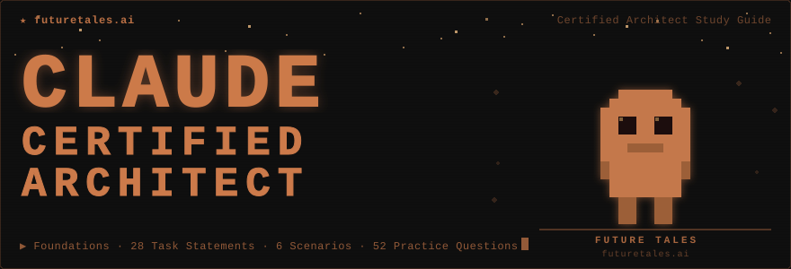

<p align="center">
  
</p>

<br/>

<p align="center">
  <a href="https://github.com/felmco/claude-architect-study-guide/stargazers">
    
  </a>
  
  
  
  
  
</p>

<br/>

> A complete, hands-on preparation repository for the **Claude Certified Architect – Foundations** certification exam. Every task statement has working Python code, sequence diagrams, and exam-aligned practice questions — built by [Future Tells](https://github.com/felmco).

---

## Exam at a Glance

| Domain | Topic | Weight | Priority |
|:------:|-------|:------:|:--------:|
| **1** | Agentic Architecture & Orchestration | **27%** | 🔴 Highest |
| **3** | Claude Code Configuration & Workflows | **20%** | 🔴 High |
| **4** | Prompt Engineering & Structured Output | **20%** | 🟡 High |
| **2** | Tool Design & MCP Integration | **18%** | 🟡 Medium |
| **5** | Context Management & Reliability | **15%** | 🟢 Medium |

**Format:** Multiple choice · 4 choices · 1 correct answer · Scaled score 100–1,000 · **Pass: 720**

---

## What's Inside

```
claude-architect-study-guide/
│
├── 📁 domain-1-agentic-architecture/   ← Tasks 1.1–1.7  (27%)
├── 📁 domain-2-tool-design-mcp/        ← Tasks 2.1–2.5  (18%)
├── 📁 domain-3-claude-code/            ← Tasks 3.1–3.6  (20%)
├── 📁 domain-4-prompt-engineering/     ← Tasks 4.1–4.6  (20%)
├── 📁 domain-5-context-reliability/    ← Tasks 5.1–5.6  (15%)
│
├── 📁 scenarios/                       ← 6 complete mini-projects
│   ├── scenario-1-customer-support/    ← Agent + MCP server + 9 tests
│   ├── scenario-2-code-generation/     ← CLAUDE.md + .claude/ config demo
│   ├── scenario-3-multi-agent-research/← Coordinator + 4 subagents
│   ├── scenario-4-developer-productivity/
│   ├── scenario-5-ci-cd/               ← GitHub Actions workflow
│   └── scenario-6-extraction/          ← Pydantic + Batch API pipeline
│
├── 📁 practice-exam/
│   ├── sample_questions.md             ← All 12 official questions + code refs
│   └── knowledge_checks/              ← 40 extra questions (8 per domain)
│
├── 📁 reference/
│   ├── cheat-sheet.md                  ← Exam-day quick reference
│   ├── concepts-glossary.md            ← All key terms defined
│   ├── api-changes.md                  ← v0.1 guide vs 2026 docs differences
│   └── study-schedule.md              ← 4-week prep plan
│
├── CLAUDE.md                           ← Live Domain 3 demonstration
└── .mcp.json                           ← Project-scoped MCP with ${VAR} expansion
```

> **This repo IS the demonstration.** The `.claude/` config, `CLAUDE.md`, `.mcp.json`, and skill frontmatter are all real, working examples of the Domain 3 patterns tested on the exam.

---

## The 6 Exam Scenarios

The exam draws **4 of these 6 scenarios at random** — know all of them.

| # | Scenario | Domains | Sample Questions |
|:-:|----------|:-------:|:---------------:|
| 1 | Customer Support Resolution Agent | 1, 2, 5 | Q1 · Q2 · Q3 |
| 2 | Code Generation with Claude Code | 3, 5 | Q4 · Q5 · Q6 |
| 3 | Multi-Agent Research System | 1, 2, 5 | Q7 · Q8 · Q9 |
| 4 | Developer Productivity with Claude | 2, 3, 1 | — |
| 5 | Claude Code for CI/CD | 3, 4 | Q10 · Q11 · Q12 |
| 6 | Structured Data Extraction | 4, 5 | — |

---

## Quick Start

```bash
# 1. Clone
git clone https://github.com/felmco/claude-architect-study-guide.git
cd claude-architect-study-guide

# 2. Set your API key
cp .env.example .env
#  → edit .env: ANTHROPIC_API_KEY=sk-ant-...

# 3. Install dependencies
pip install anthropic fastmcp pydantic python-dotenv pytest pytest-asyncio

# 4. Run smoke tests  (~$0.05–0.15 total)
make smoke-test

# 5. Run unit tests (mocked, free)
pytest scenarios/scenario-1-customer-support/test_agent.py -v
```

**Expected smoke test output:**

```
Domain 1 smoke test passed.   ← agentic loop: stop_reason control flow
Domain 4 smoke test passed.   ← structured output: tool_use + JSON schema
Scenario 1 smoke test passed. ← customer support agent end-to-end
```

---

## Recommended Study Order

Follow domain weight × coverage gap to maximize exam ROI:

### Week 1 — Cover the zero-coverage domains (45% of exam)
```
domain-1-agentic-architecture/README.md   ← read first, sequence diagrams
  1_1_agentic_loop.py           ← run it
  1_4_workflow_enforcement.py   ← most exam-critical file in the repo
scenarios/scenario-1-customer-support/    ← covers Q1, Q2, Q3
domain-3-claude-code/README.md            ← .claude/ config patterns
  3_4_plan_vs_direct.md         ← memorize the decision matrix
```

### Week 2 — Multi-agent + Tool design (45% combined)
```
1_2_coordinator_subagent.py               ← Q7 pattern (narrow decomposition)
1_5_hooks.py                              ← PostToolUse normalization + interception
scenarios/scenario-3-multi-agent-research/← Q8, Q9 patterns
domain-2-tool-design-mcp/                 ← tool descriptions + MCP scoping
```

### Week 3 — Prompt Engineering + Context (35% combined)
```
domain-4-prompt-engineering/4_3_structured_output.py  ← tool_use + nullable fields
domain-4-prompt-engineering/4_5_batch_processing.py   ← Q11 (Batch API)
domain-4-prompt-engineering/4_6_multi_pass_review.py  ← Q12 (attention dilution)
domain-5-context-reliability/                          ← escalation, provenance, errors
```

### Week 4 — Integration + Practice Exam
```
reference/cheat-sheet.md                  ← read and memorize key tables
practice-exam/sample_questions.md         ← all 12 questions, timed, no peeking
practice-exam/knowledge_checks/           ← 40 more questions by domain
```

---

## Practice Questions

**52 total questions** in exam format (4 choices, 1 correct, full explanation):

| File | Questions | Covers |
|------|:---------:|--------|
| `practice-exam/sample_questions.md` | **12** | Official sample questions Q1–Q12 |
| `knowledge_checks/domain1_questions.md` | 5 | Agentic loops, hooks, coordinator patterns |
| `knowledge_checks/domain2_questions.md` | 5 | Tool descriptions, errors, MCP scoping |
| `knowledge_checks/domain3_questions.md` | 10 | CLAUDE.md, skills, CI/CD, plan mode |
| `knowledge_checks/domain4_questions.md` | 10 | Structured output, batch, few-shot, retry |
| `knowledge_checks/domain5_questions.md` | 10 | Context, escalation, provenance, recovery |

---

## Exam-Day Anti-Pattern Cheat Sheet

The exam specifically tests these wrong-answer traps:

| If you see this in a question... | The right answer is NOT... | It IS... |
|----------------------------------|---------------------------|----------|
| Mandatory tool ordering | "Add to system prompt" | Programmatic prerequisite |
| Escalation criteria | "Confidence score < 7" | Explicit categorical criteria |
| CI/CD pipeline hanging | `--batch` or `--headless` | `-p` flag |
| 14-file PR inconsistent review | "Larger context window" | Per-file passes + integration pass |
| Batch API for pre-merge check | "Poll frequently" | Synchronous API (blocking) |
| Subagent timeout | `{"status": "unavailable"}` | Structured context with failure_type |
| Test files spread across repo | Subdirectory `CLAUDE.md` | `.claude/rules/` with glob `paths:` |
| Agentic loop termination | Parse response text for "done" | Check `stop_reason == "end_turn"` |

---

## Reference

| File | Purpose |
|------|---------|
| [`reference/cheat-sheet.md`](reference/cheat-sheet.md) | stop_reason · tool_choice · MCP scopes · error categories |
| [`reference/api-changes.md`](reference/api-changes.md) | "Claude Code SDK" → "Claude Agent SDK"; scope renames |
| [`reference/concepts-glossary.md`](reference/concepts-glossary.md) | Every term from the exam guide appendix |
| [`reference/study-schedule.md`](reference/study-schedule.md) | 4-week day-by-day study plan |

---

## Cost Estimate

| Activity | Model | Cost |
|----------|-------|------|
| `make smoke-test` | claude-haiku-4-5 | ~$0.05–0.15 |
| Scenario 1 full run | claude-haiku-4-5 | ~$0.10–0.25 |
| Scenario 3 full run | claude-haiku-4-5 | ~$0.15–0.35 |
| All scenarios end-to-end | claude-haiku-4-5 | < $2.00 |
| `pytest` unit tests | *(no API calls)* | Free |

---

## Key Links

- [Anthropic Documentation](https://docs.anthropic.com)
- [Claude Agent SDK Overview](https://docs.anthropic.com/en/agent-sdk/overview)
- [MCP Documentation](https://modelcontextprotocol.io)
- [Claude Code Best Practices](https://www.anthropic.com/engineering/claude-code-best-practices)

---

<p align="center">
  <sub>
    Developed with ♥ by <strong><a href="https://github.com/felmco">Future Tells</a></strong>
    &nbsp;·&nbsp;
    Powered by <strong>Anthropic Claude</strong>
    &nbsp;·&nbsp;
    Not affiliated with Anthropic
  </sub>
</p>
