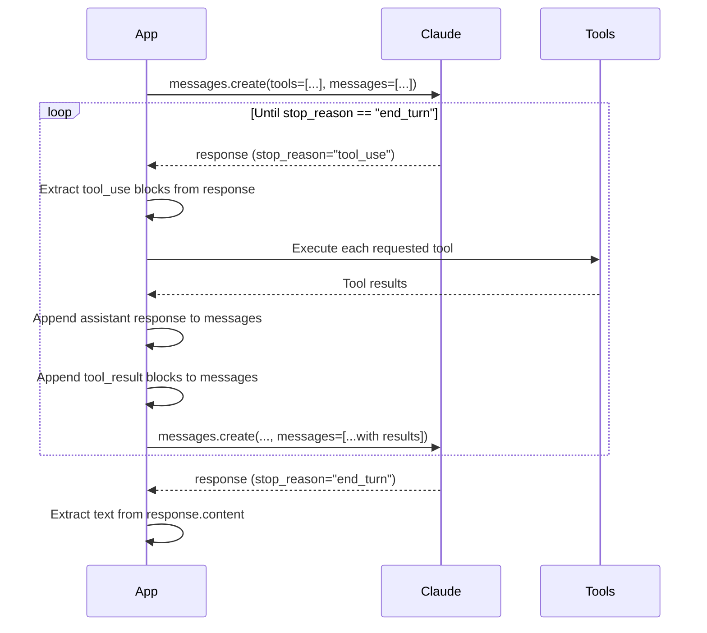
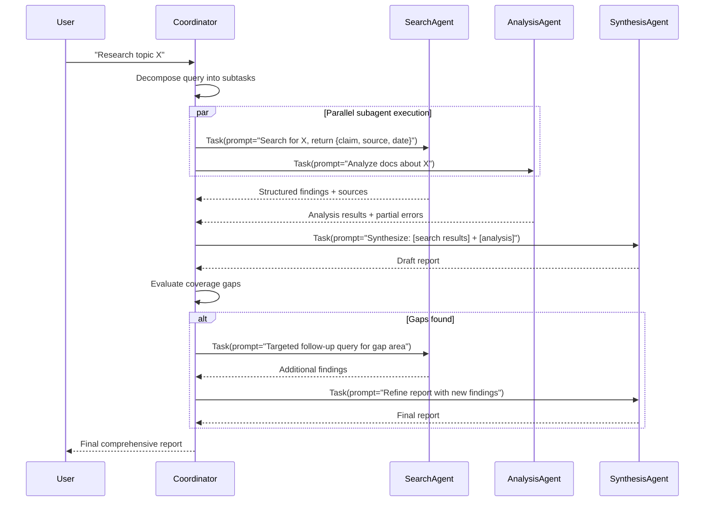
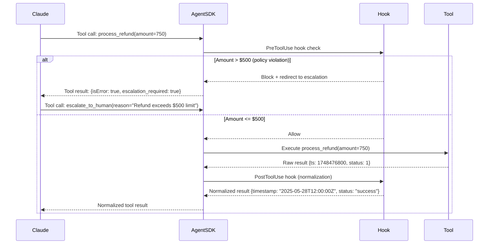
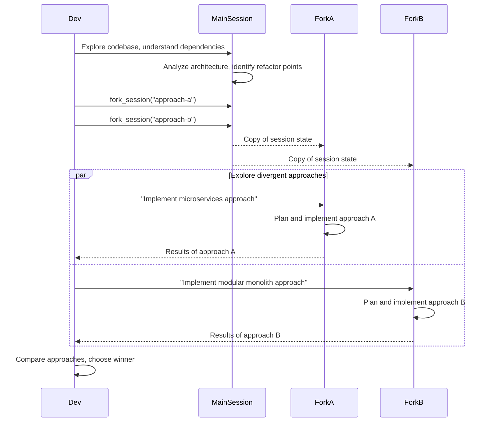

# Domain 1: Agentic Architecture & Orchestration (27%)

This domain covers the core patterns for building agents that autonomously execute multi-step tasks. It is the highest-weighted domain on the exam.

---

## Task Statements → Files

| Task | Description | File |
|------|-------------|------|
| 1.1 | Agentic loop lifecycle: stop_reason, tool execution, iteration | `1_1_agentic_loop.py` |
| 1.2 | Multi-agent coordinator-subagent patterns | `1_2_coordinator_subagent.py` |
| 1.3 | Subagent invocation, context passing, parallel spawning | `1_3_subagent_spawning.py` |
| 1.4 | Multi-step workflows with enforcement and handoff | `1_4_workflow_enforcement.py` |
| 1.5 | Agent SDK hooks for tool call interception | `1_5_hooks.py` |
| 1.6 | Task decomposition: chaining vs dynamic | `1_6_task_decomposition.py` |
| 1.7 | Session state, resumption, forking | `1_7_session_management.py` |

---

## Key Concepts

### The Agentic Loop
An agentic loop sends requests to Claude, inspects `stop_reason`, executes tools, appends results to conversation history, and continues until `stop_reason == "end_turn"`.

**Critical:** The loop terminates on `"end_turn"`, NOT on detecting text patterns in the response.

### stop_reason Values
| Value | Meaning | Action |
|-------|---------|--------|
| `"tool_use"` | Claude wants to call one or more tools | Execute the tools, append results, continue loop |
| `"end_turn"` | Claude has finished reasoning | Extract text response, terminate loop |
| `"max_tokens"` | Token limit reached | Handle gracefully (summarize/truncate) |

### Hub-and-Spoke Architecture
The coordinator is the only agent that communicates between subagents. No direct subagent-to-subagent communication. This provides:
- Observability (all traffic flows through one point)
- Consistent error handling
- Controlled information flow

### Subagent Context Isolation
Subagents do NOT automatically inherit the coordinator's conversation history. The coordinator must explicitly pass all required context in the subagent's prompt.

---

## Sequence Diagrams

### 1. Agentic Loop with stop_reason Branching

### 2. Hub-and-Spoke Coordinator

### 3. PostToolUse Hook Interception

### 4. Session Fork for Divergent Approaches

---

## Anti-Patterns to Avoid (Exam Traps)

| Anti-Pattern | Why It's Wrong | Correct Approach |
|-------------|----------------|-----------------|
| Check `response.content[0].text` contains "done" to end loop | LLM text is unreliable for control flow | Check `stop_reason == "end_turn"` |
| Set `max_iterations = 10` as primary stopping mechanism | Arbitrary cap causes silent failures | Use `stop_reason`, cap only as safety net |
| Parse natural language in tool results to detect errors | Fragile, language-dependent | Use structured `isError` flag |
| Subagent inherits coordinator context automatically | False — isolation is by design | Pass full context explicitly in subagent prompt |
| Use prompt-only for mandatory tool ordering | Non-zero failure rate | Use programmatic prerequisites |

---

## Exam Sample Questions Mapped Here

- **Q1** (Sample): Programmatic prerequisite vs prompt-only → `1_4_workflow_enforcement.py`
- **Q7** (Sample): Coordinator task decomposition too narrow → `1_2_coordinator_subagent.py`
- **Q8** (Sample): Structured error propagation → `1_3_subagent_spawning.py` + Domain 5
- **Q9** (Sample): Scoped verify_fact tool → `2_3_tool_distribution.py`
