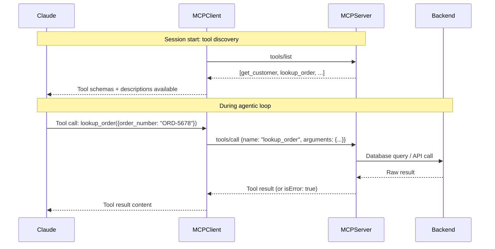
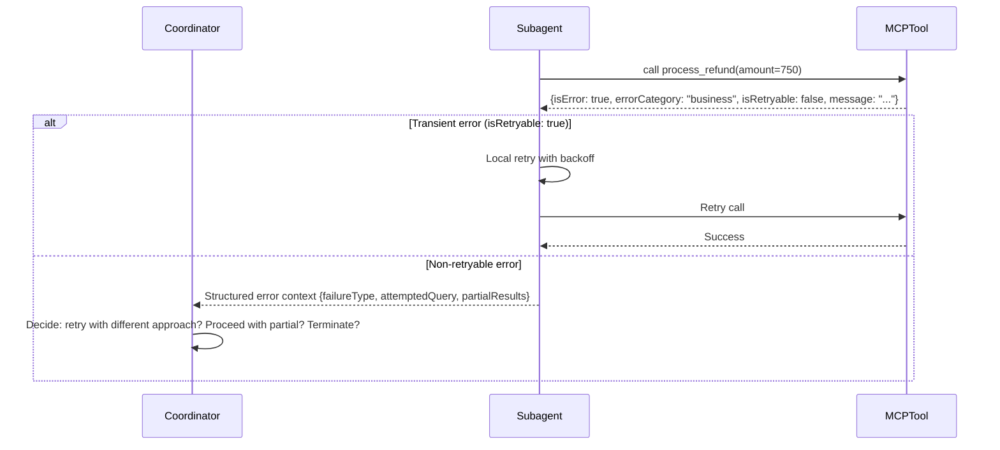

# Domain 2: Tool Design & MCP Integration (18%)

---

## Task Statements → Files

| Task | Description | File |
|------|-------------|------|
| 2.1 | Effective tool descriptions with clear boundaries | `2_1_tool_descriptions.py` |
| 2.2 | Structured error responses for MCP tools | `2_2_structured_errors.py` |
| 2.3 | Tool distribution across agents + tool_choice | `2_3_tool_distribution.py` |
| 2.4 | MCP server integration into Claude Code | `2_4_mcp_integration/` |
| 2.5 | Built-in tools: Read, Write, Edit, Bash, Grep, Glob | `2_5_builtin_tools.py` |

---

## Key Concepts

### Tool Descriptions Are the Primary Selection Mechanism
Claude selects tools based on their descriptions. Minimal descriptions = unreliable selection, especially between similar tools.

**Good description includes:**
- What it does
- When to use it (and when NOT to)
- Expected inputs and outputs
- Edge cases and boundaries
- How it differs from similar tools

### MCP Scoping (2026 terminology — differs from v0.1 exam guide)

| Scope | Stored In | Shared? | Use When |
|-------|-----------|---------|----------|
| `local` (default) | `~/.claude.json` (per-project) | No | Personal/experimental |
| `project` | `.mcp.json` in repo | Yes (via version control) | Team-shared tools |
| `user` | `~/.claude.json` (global) | No | Personal tools across all projects |

> **Exam guide v0.1 terminology:** `project` and `global` → now `project` and `user`

### MCP Resources vs Tools
- **Tools**: Actions the agent can take (GET/POST/DELETE to backends)
- **Resources**: Content catalogs the agent can browse (gives visibility without exploratory calls)

---

## Sequence Diagrams

### 1. MCP Tool Invocation Cycle



### 2. Structured Error Propagation



---

## Tool choice Options Summary

```python
# Auto: model decides whether to call a tool
tool_choice = {"type": "auto"}  # default when tools provided

# Any: model must call a tool (guarantees structured output)
tool_choice = {"type": "any"}

# Forced: model must call this specific tool
tool_choice = {"type": "tool", "name": "extract_metadata"}

# None: model cannot call any tool
tool_choice = {"type": "none"}  # default when no tools provided
```

---

## Exam Sample Questions Mapped Here

- **Q2** (Sample): Expand tool descriptions with input formats, examples, boundaries → `2_1_tool_descriptions.py`
- **Q9** (Sample): Scoped verify_fact tool for synthesis agent → `2_3_tool_distribution.py`
