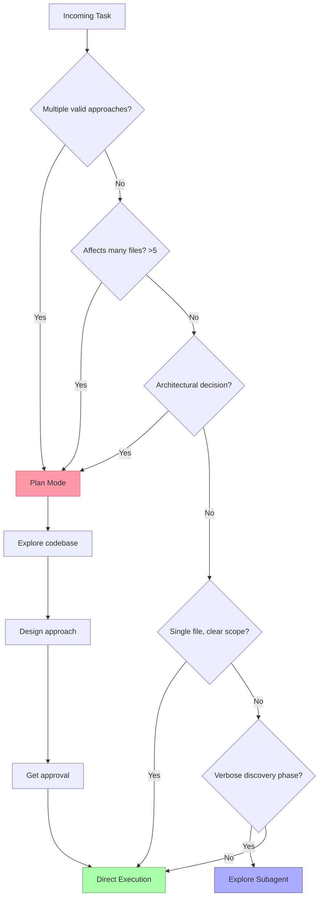

# Domain 3: Claude Code Configuration & Workflows (20%)

---

## Task Statements → Files/Folders

| Task | Description | Location |
|------|-------------|----------|
| 3.1 | CLAUDE.md hierarchy: user/project/directory | `3_1_claude_md_hierarchy/` |
| 3.2 | Custom slash commands and skills | `3_2_commands_skills/` |
| 3.3 | Path-specific rules in .claude/rules/ | `3_3_path_rules/` |
| 3.4 | Plan mode vs direct execution | `3_4_plan_vs_direct.md` |
| 3.5 | Iterative refinement techniques | `3_5_iterative_refinement.md` |
| 3.6 | CI/CD pipeline integration | `3_6_ci_cd/` |

---

## Key Concepts

### CLAUDE.md Hierarchy
```
~/.claude/CLAUDE.md          ← User-level (personal, NOT shared via version control)
<repo>/CLAUDE.md             ← Project-level (shared when committed)
<repo>/.claude/CLAUDE.md     ← Project-level alternative
<repo>/src/CLAUDE.md         ← Directory-level (applies only to src/ and below)
```

**@import syntax:** Include other files to keep CLAUDE.md modular:
```markdown
@import .claude/rules/testing.md
@import .claude/rules/api-conventions.md
```

### .claude/ Directory Structure
```
.claude/
├── commands/         ← Project-scoped slash commands (shared via git)
│   └── review.md     ← Defines /review command
├── rules/            ← Path-scoped rules (auto-loaded for matching files)
│   ├── python.md     ← paths: ["**/*.py"]
│   ├── tests.md      ← paths: ["**/*.test.*", "**/test_*.py"]
│   └── terraform.md  ← paths: ["terraform/**/*"]
└── skills/           ← Project-scoped skills
    └── analyze/
        └── SKILL.md  ← context: fork, allowed-tools: Read,Grep,Glob
```

### SKILL.md Frontmatter Options
```yaml
---
name: explore-codebase
description: Explore and summarize codebase structure for a given topic
context: fork        # Run in isolated sub-agent — output stays isolated
allowed-tools: Read,Grep,Glob  # Restrict which tools this skill can use
argument-hint: "topic or file path to explore"
---
```

### CLI Flags for CI/CD
```bash
# Non-interactive mode (required for CI)
claude -p "Analyze this PR for security issues"

# Structured JSON output
claude -p "..." --output-format json --json-schema schema.json

# Resume a named session
claude --resume my-investigation-session
```

---

## Decision Tree: Plan Mode vs Direct Execution



---

## Exam Sample Questions Mapped Here

- **Q4** (Sample): Project-scoped commands in `.claude/commands/` → Task 3.2
- **Q5** (Sample): Plan mode for monolith-to-microservices → Task 3.4
- **Q6** (Sample): `.claude/rules/` with glob patterns for test files → Task 3.3
- **Q10** (Sample): `-p` flag for non-interactive CI → Task 3.6
