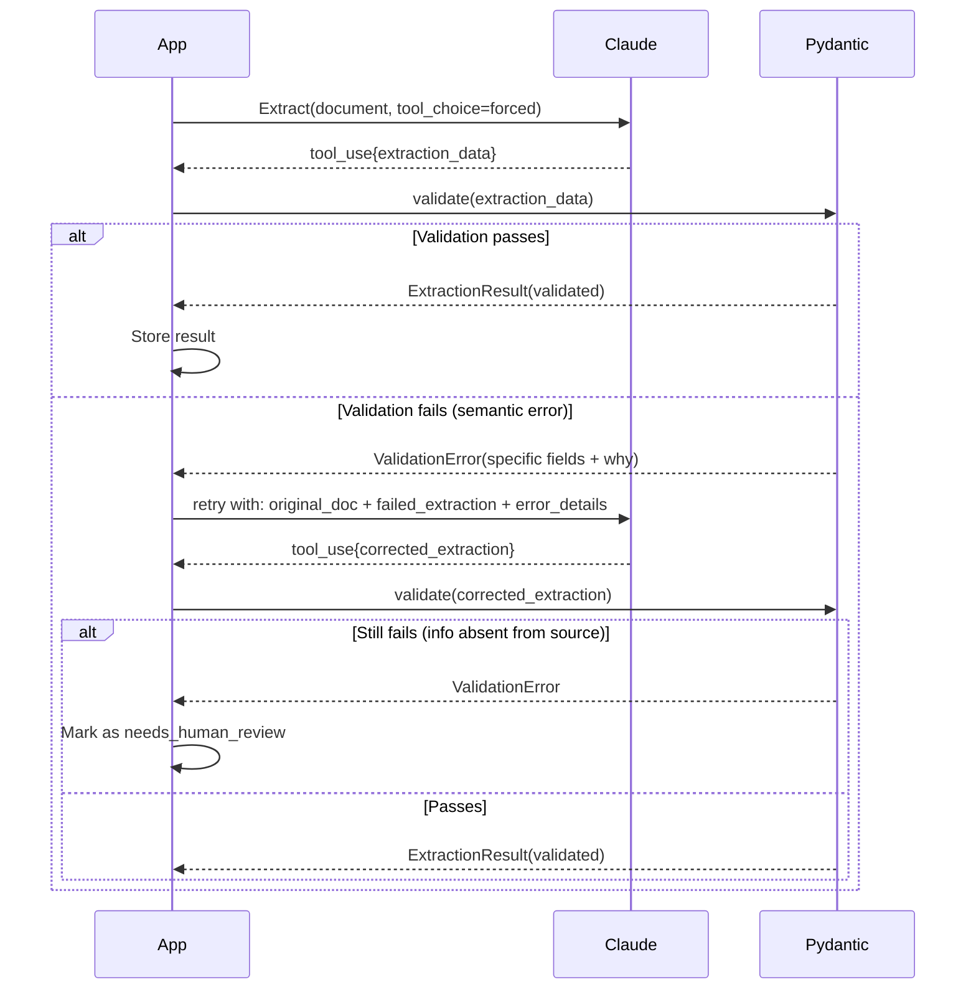
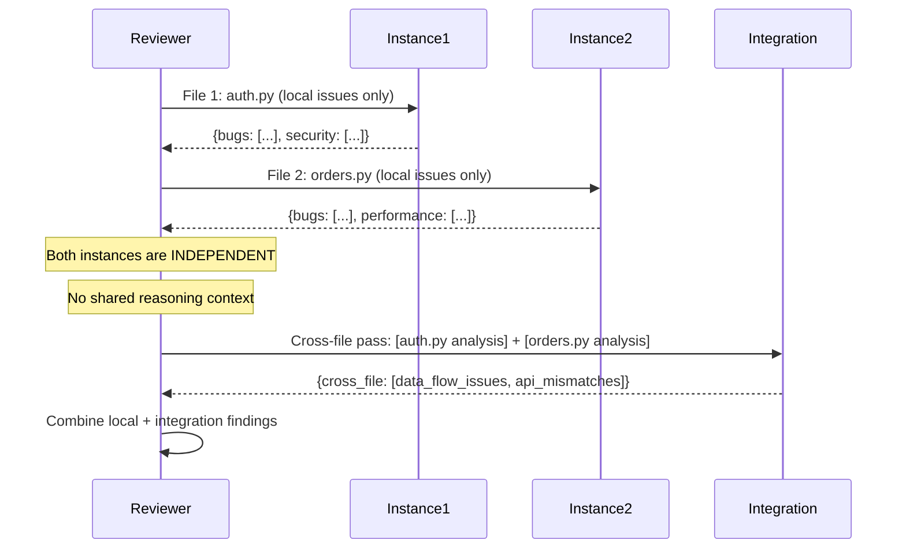

# Domain 4: Prompt Engineering & Structured Output (20%)

---

## Task Statements → Files

| Task | Description | File |
|------|-------------|------|
| 4.1 | Explicit criteria to reduce false positives | `4_1_explicit_criteria.py` |
| 4.2 | Few-shot prompting for consistency | `4_2_few_shot.py` |
| 4.3 | Structured output via tool_use + JSON schemas | `4_3_structured_output.py` |
| 4.4 | Validation-retry loops with error feedback | `4_4_validation_retry.py` |
| 4.5 | Message Batches API for batch processing | `4_5_batch_processing.py` |
| 4.6 | Multi-pass review with independent instances | `4_6_multi_pass_review.py` |

---

## Sequence Diagrams

### 1. Validation-Retry Loop (Pydantic)



### 2. Multi-Pass Code Review



---

## Message Batches API — When To Use

| Workflow | Use Sync API | Use Batch API |
|----------|-------------|--------------|
| Pre-merge code review | ✓ (blocking) | ✗ |
| Overnight technical debt report | ✗ | ✓ (50% savings) |
| Real-time chat response | ✓ | ✗ |
| Weekly mass document extraction | ✗ | ✓ |
| Generating tests during PR | ✓ | ✗ |

**Batch API characteristics:**
- 50% cost savings
- Processing time: up to 24 hours (usually < 1 hour)
- No guaranteed latency SLA
- No multi-turn tool calling within a single request
- `custom_id` for correlating requests/responses

---

## JSON Schema Best Practices

```python
# Required vs optional fields
schema = {
    "type": "object",
    "properties": {
        "invoice_number": {"type": "string"},        # Required → hallucinated if absent
        "total": {"type": "number"},                  # Required → model must provide value
        "purchase_order": {"type": ["string", "null"]}, # Optional → model can return null
        "notes": {"type": ["string", "null"]},        # Optional → no hallucination needed
        "status": {
            "type": "string",
            "enum": ["paid", "pending", "overdue", "other"],  # "other" for extensibility
        },
        "status_detail": {"type": ["string", "null"]},  # Explanation when status="other"
    },
    "required": ["invoice_number", "total"],  # Only truly required fields
}
```

---

## Exam Questions Mapped Here

- **Q3** (Sample): Explicit escalation criteria vs confidence scores → Task 4.1
- **Q11** (Sample): Batch API for overnight vs blocking workflows → Task 4.5
- **Q12** (Sample): Multi-pass review for 14-file PR → Task 4.6
