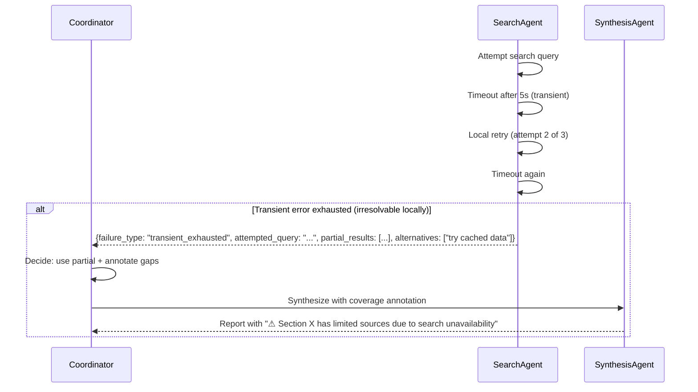
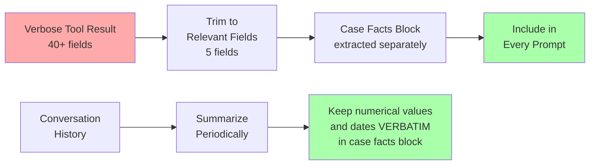

# Domain 5: Context Management & Reliability (15%)

---

## Task Statements → Files

| Task | Description | File |
|------|-------------|------|
| 5.1 | Preserve critical information across long interactions | `5_1_context_preservation.py` |
| 5.2 | Escalation and ambiguity resolution patterns | `5_2_escalation_patterns.py` |
| 5.3 | Error propagation across multi-agent systems | `5_3_error_propagation.py` |
| 5.4 | Context management in large codebase exploration | `5_4_large_codebase.py` |
| 5.5 | Human review workflows and confidence calibration | `5_5_human_review.py` |
| 5.6 | Information provenance in multi-source synthesis | `5_6_provenance.py` |

---

## Key Concepts

### "Lost in the Middle" Effect
Models reliably process information at the **beginning** and **end** of long inputs,
but may miss content in the **middle**. Mitigation:
- Put key findings at the **beginning** of aggregated inputs
- Use explicit section headers
- Keep critical facts in a separate "case facts" block

### Case Facts Block Pattern
Instead of relying on summarized history, extract transactional facts to a persistent block:
```python
case_facts = {
    "customer_id": "CUST-1234",
    "order_total": 125.00,
    "refund_requested": 125.00,
    "return_window_expires": "2025-06-19",
}
```
This block is included in EVERY prompt, outside the summarized conversation history.

### Escalation Criteria (Not Sentiment-Based)
| Trigger | Action |
|---------|--------|
| Customer explicitly requests human | Escalate IMMEDIATELY — no negotiation |
| Refund > autonomous limit | Escalate |
| Policy gap — situation not in policy | Escalate |
| 2+ unsuccessful resolution attempts | Escalate |
| Customer frustration alone | Do NOT escalate if issue is resolvable |

---

## Sequence Diagrams

### 1. Error Propagation in Multi-Agent Systems



### 2. Context Preservation Strategy



---

## Exam Questions Mapped Here

- **Q8** (Sample): Structured error context for coordinator recovery → Task 5.3
- Domain 5 concepts also appear in Scenario 1 (escalation) and Scenario 3 (provenance)
