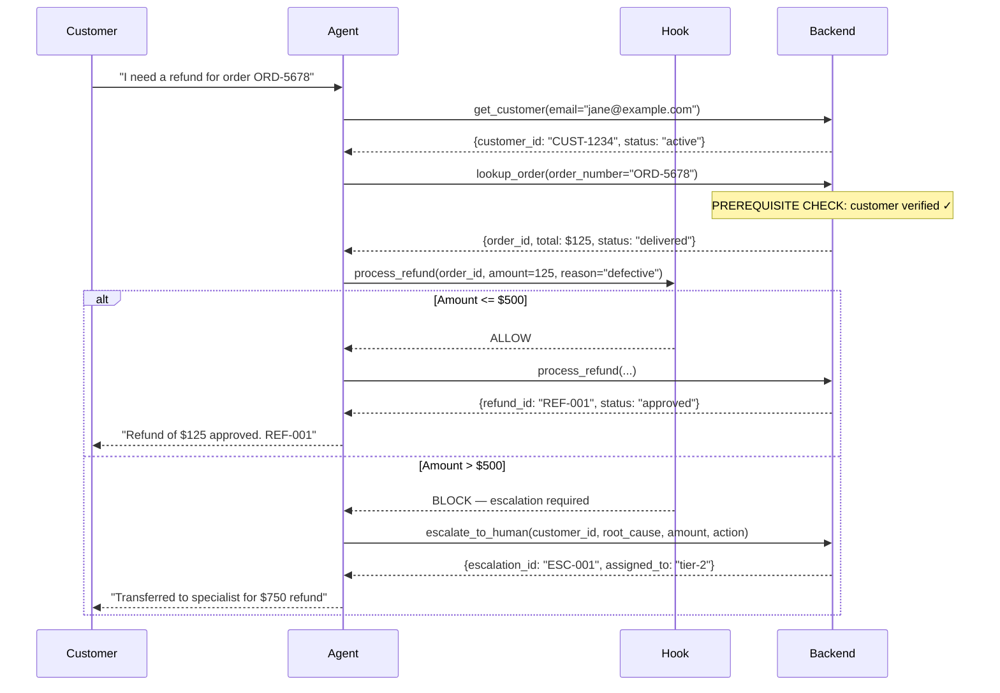

# Scenario 1: Customer Support Resolution Agent

**Primary Domains:** 1 (Agentic Architecture), 2 (Tool Design & MCP), 5 (Context & Reliability)

**Exam questions based on this scenario:** Q1, Q2, Q3

---

## The System

A customer support agent that handles returns, billing disputes, and account issues. Target: 80%+ first-contact resolution.

**MCP Tools:**
- `get_customer` — verify customer identity (MUST be called first)
- `lookup_order` — retrieve order details (requires verified customer)
- `process_refund` — issue refund (requires verified customer + looked-up order)
- `escalate_to_human` — structured handoff to human agent

**Business Rules (enforced programmatically):**
- `lookup_order` blocked until `get_customer` returns verified customer_id
- `process_refund` blocked until both `get_customer` and `lookup_order` complete
- Refunds > $500 intercepted by hook and redirected to `escalate_to_human`

---

## Sequence Diagram: Full Customer Support Flow



---

## Files

| File | Purpose |
|------|---------|
| `mcp_server.py` | FastMCP server with 4 tools |
| `agent.py` | Full agentic loop + programmatic prerequisites |
| `hooks.py` | PreToolUse hook for refund limit, PostToolUse for normalization |
| `test_agent.py` | Unit tests: tool ordering, hook enforcement, escalation |

---

## Running

```bash
# Set your API key first
cp ../../.env.example ../../.env
# Edit .env with your key

# Full interactive run
python agent.py

# Smoke test (minimal, cheap)
python agent.py --smoke

# Unit tests (mocked, free)
pytest test_agent.py -v
```

---

## Exam Questions Exercised

**Q1:** Production data shows 12% of cases skip `get_customer`.
→ Answer A: Programmatic prerequisite blocking `lookup_order` until verified.
→ See: `agent.py` `WorkflowState` class and `lookup_order()` prerequisite check.

**Q2:** Agent calls `get_customer` when users ask about orders (both tools have minimal descriptions).
→ Answer B: Expand tool descriptions with input formats, examples, and boundaries.
→ See: `mcp_server.py` tool descriptions — detailed vs minimal comparison.

**Q3:** Agent achieves 55% first-contact resolution (escalates simple cases, attempts complex ones).
→ Answer A: Explicit escalation criteria + few-shot examples in system prompt.
→ See: `agent.py` `SYSTEM_PROMPT` with escalation criteria.
