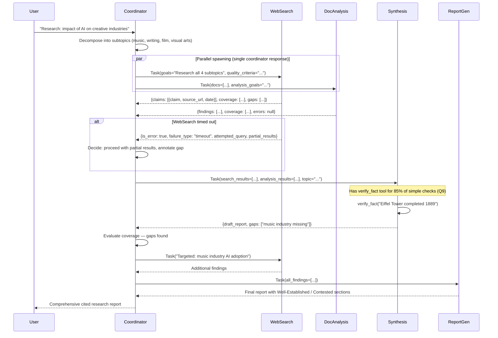

# Scenario 3: Multi-Agent Research System

**Primary Domains:** 1 (Agentic Architecture), 2 (Tool Design & MCP), 5 (Context & Reliability)

**Exam questions based on this scenario:** Q7, Q8, Q9

---

## The System

A coordinator agent delegates to 4 specialized subagents:
1. **Web Search** — finds relevant articles, returns structured `{claim, evidence, source_url, date}`
2. **Document Analysis** — analyzes provided documents, extracts key findings
3. **Synthesis** — combines findings from other agents, has `verify_fact` scoped tool (Q9)
4. **Report Generation** — produces final report distinguishing well-established from contested findings

---

## Sequence Diagram: Parallel Research Pipeline

---

## Files

| File | Purpose |
|------|---------|
| `coordinator.py` | Hub-and-spoke coordinator with parallel spawning + iterative refinement |
| `agents/web_search.py` | Web search subagent with structured output + error handling |
| `agents/doc_analysis.py` | Document analysis subagent |
| `agents/synthesis.py` | Synthesis subagent with scoped verify_fact tool |
| `agents/report_gen.py` | Report generation with well-established vs contested sections |

---

## Key Exam Patterns Demonstrated

**Q7:** Coordinator decomposes comprehensively (not just visual arts).
**Q8:** WebSearch returns structured error context when it fails.
**Q9:** Synthesis has scoped `verify_fact` tool for 85% of simple verifications.
