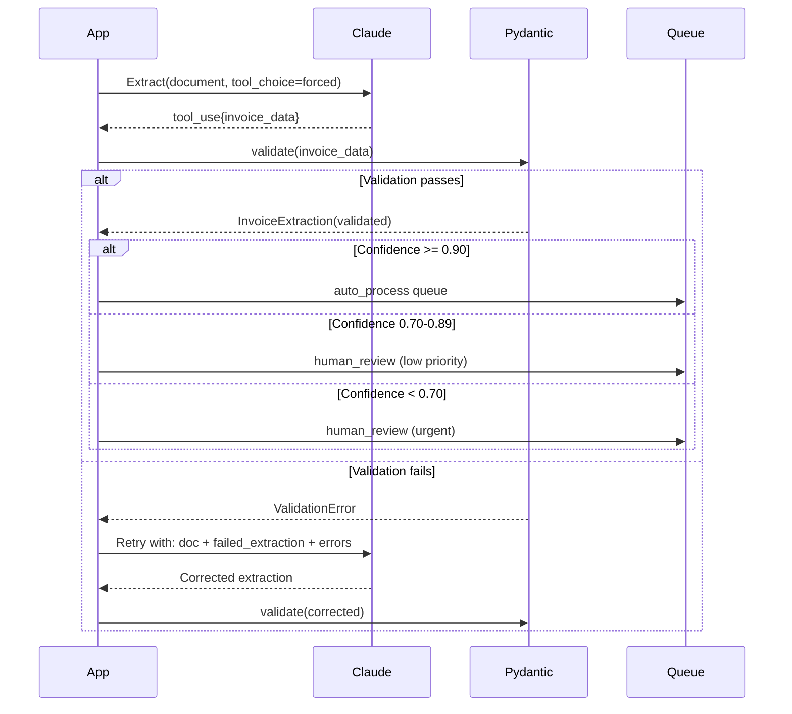

# Scenario 6: Structured Data Extraction

**Primary Domains:** 4 (Prompt Engineering), 5 (Context & Reliability)

**Exam questions:** Based on Scenario 6 questions (not in the 12 sample questions — scenarios are drawn randomly)

---

## The System

Document extraction pipeline:
- Forced tool_use extraction with nullable fields
- Pydantic validation + retry with error feedback
- Confidence-based human review routing
- Message Batches API for bulk processing

---

## Sequence Diagram: Extraction + Validation + Routing

---

## Files

| File | Purpose |
|------|---------|
| `extractor.py` | Tool_use extraction with nullable fields |
| `validator.py` | Pydantic validation + retry loop |
| `batch_processor.py` | Message Batches API bulk processing |
| `schemas/document_schema.json` | Full JSON schema |
